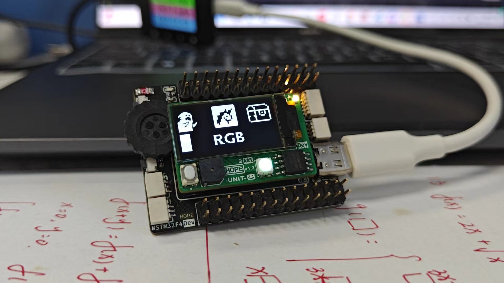
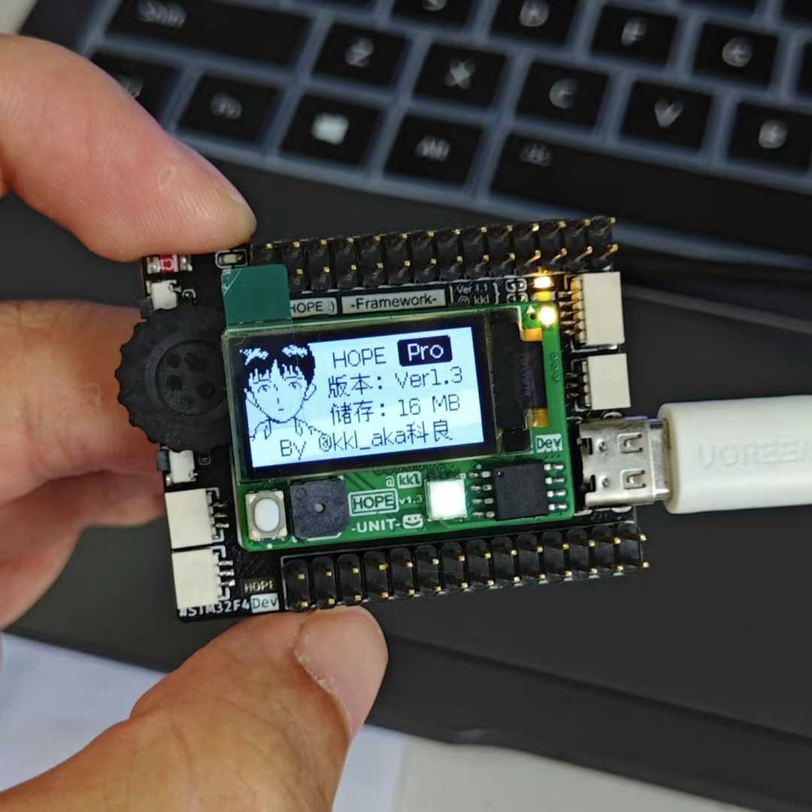
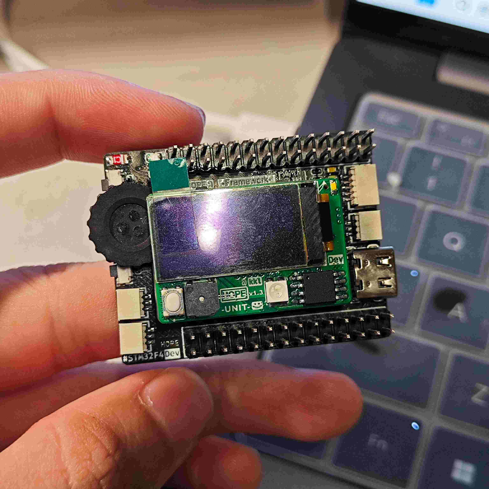
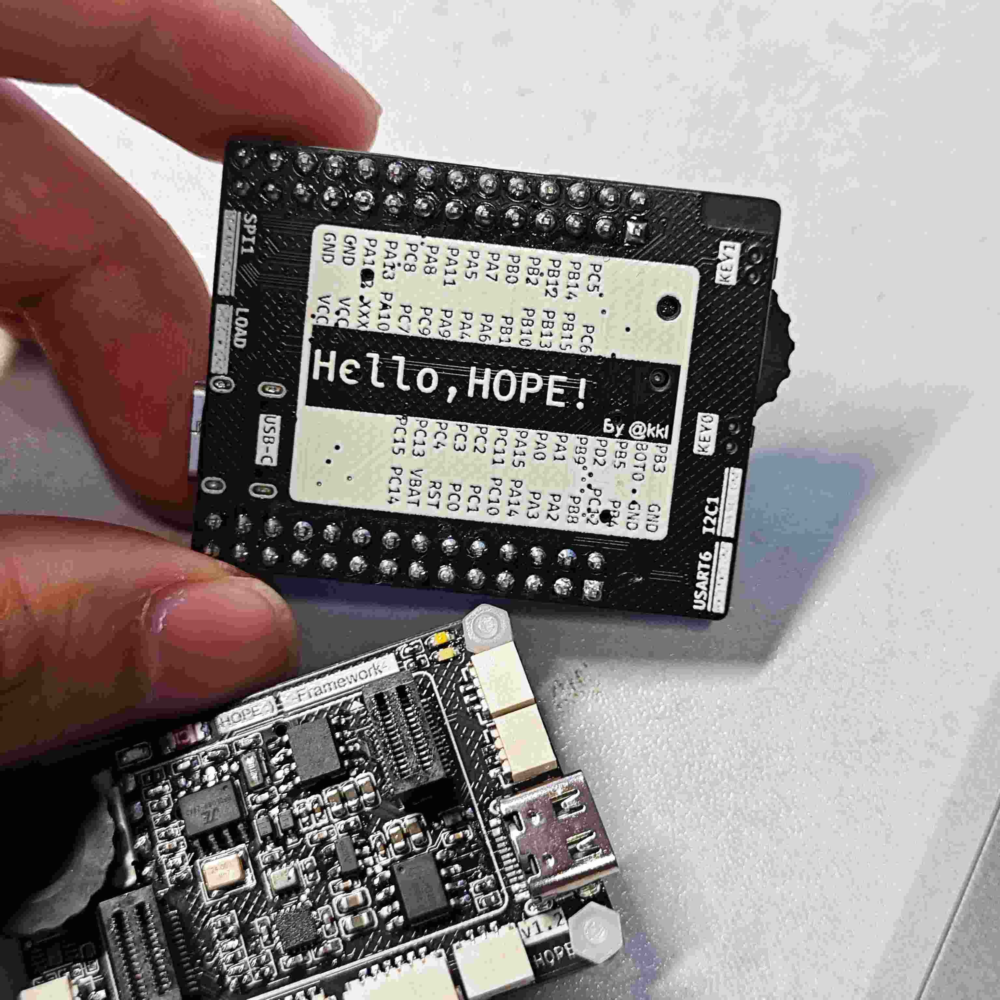
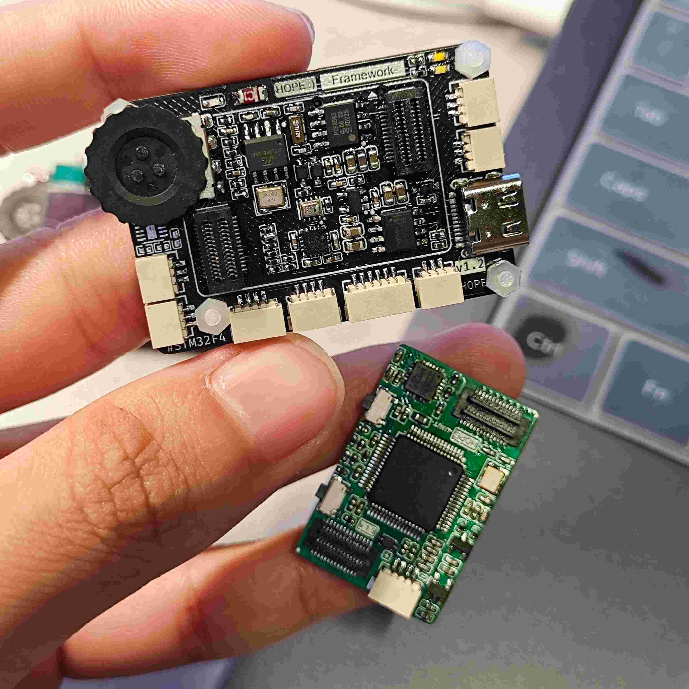

# AboutHOPE
# 关于HOPE

### [寓意着希望好事发生，以此纪念自己第一次参加2023年全国大学生电子设计大赛]
### [当时我们电赛匆匆画的板子，咱们也取名叫做HOPE!]
### [虽然参赛期间小插曲不断，但是最终获得了全国二等奖！鼓掌piapiapiapiapia!]
---

## documents

- 部分相关文档：[戳这里:)](https://zhangkeliang0627.github.io/2024/08/31/谈谈HOPE当中的GUI底层逻辑实现/README/)

- 硬件开源地址：[戳这里:)](https://oshwhub.com/hugego/hope-stm32f401-based-mini-devframework)

- 视频介绍：https://www.bilibili.com/video/BV1Rz42117sr/

## Snapshots

## Showcase
https://github.com/user-attachments/assets/419c04f8-05d6-4471-b534-68d76238fff4
